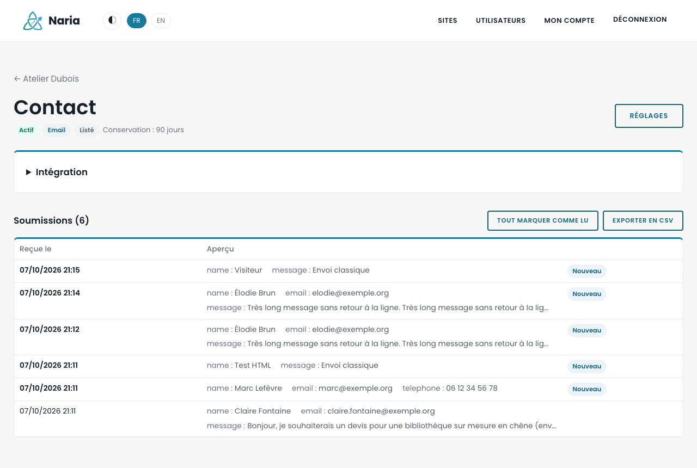
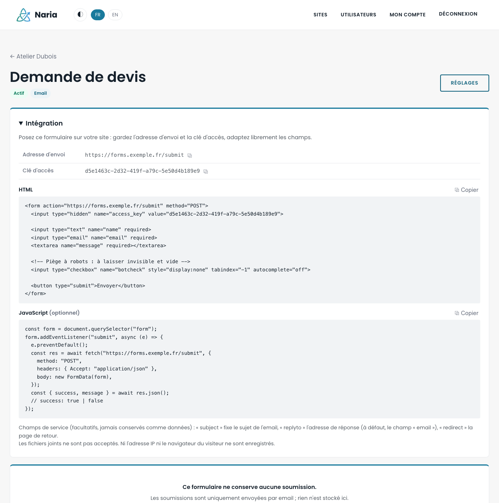
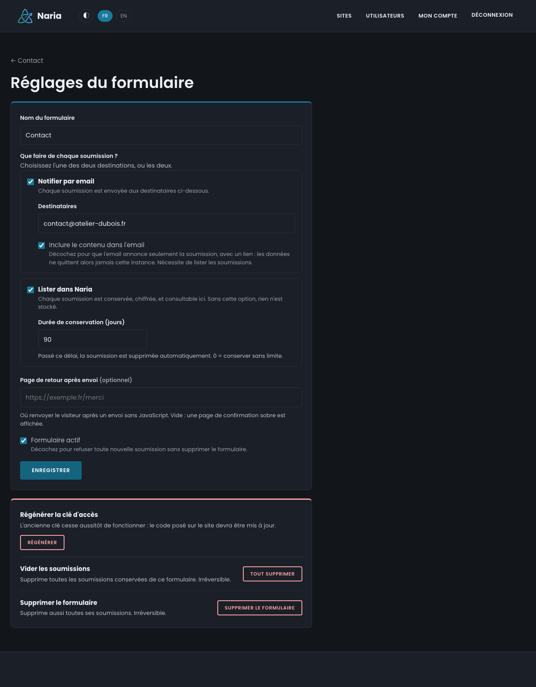

# Naria

[](https://gitlab.com/detag_inno/naria/-/pipelines)
[](https://github.com/Eliatrope38/naria/actions/workflows/ci.yml)
[](https://gitlab.com/detag_inno/naria/-/commits/main)
[](LICENSE)
[](go.mod)

A self-hosted back end for the forms on your websites. Naria is a self-hosted alternative to Web3Forms, built around privacy: your visitors' data does not pass through any third party. It is written in Go, uses `templ` for server-side rendering (no JavaScript build step) and PostgreSQL, and ships as a single binary and a container image.



## What it is

A static site has no server to receive its contact form. Naria is that server. You declare a **site** in it, create a **form**, and paste the code it gives you into your page. Each submission is then emailed to the form's recipients, listed in the interface (encrypted at rest), or both. A Slack, Microsoft Teams, Discord or Telegram alert can also notify a channel for each submission.

Accounts belong to an organisation, and there are three roles. A `user` manages the sites it owns, with their forms and submissions, and reads the submissions of the sites an administrator of its organisation has shared with it. An `admin_orga` manages every site, form and submission of its organisation, and its user accounts. The `admin` of the instance creates organisations and their administrators, and sees no site, form or submission.

## Privacy

Privacy is the reason this project exists. Each point in this section is enforced by the code and, for the most part, locked in by a test.

By default, no third party is involved: a submission goes from your site to your instance, then to the email service you designate, either your SMTP server or your Microsoft 365 mailbox. In the second case, the email is sent through Microsoft's Graph API instead of SMTP. Microsoft receives it as it would a message submitted over SMTP, and Naria asks it to keep no copy in the mailbox's Sent Items. The interface loads nothing external: fonts and styles are embedded, and the CSP allows no other origin. Slack, Teams, Discord and Telegram are third parties. The alert, which is optional and set per form, only announces that a submission arrived, with a link to the interface. Including the content is an explicit choice. The content then leaves the instance and falls outside the retention period. Attached files never go to these services: only their names appear in the content.

Naria does not keep your visitors' IP address or browser: the submissions table has no column to store them. The IP address is used only by the rate limiter, in memory, and the access log does not write it (nor does it write the query string). The public entry point neither reads nor sets any cookie. Uploaded files are ignored unless the form accepts attachments. When it does, they follow the submission: attached to the email if the email includes the content, encrypted in the database like the submission when it is listed, and deleted with it. Naria never writes them to a temporary file. If the instance has an antivirus, each file is sent to it first. This is a ClamAV daemon that you run yourself, not an online service. The daemon writes the file to its own temporary directory while scanning it, and the connection to it is not encrypted, so keep it on the same machine or on a private network. The only IP addresses kept are those of users of the interface and of programs calling the API. The audit log keeps the address of sign-ins, administrative actions and form creations through the API for 90 days.

The anti-bot check is optional and set per form. It involves no third party: the challenge comes from the instance, and the visitor's browser solves it. It does change two things, which you should know before enabling it. The form's page loads a script, so every visitor's browser contacts the instance, even if it sends nothing. Served from the instance, this script runs in your page, which amounts to trusting whoever operates the instance. To avoid both, serve a copy of the script from your own site: the instance is then contacted only when the form is submitted. In all cases, neither the script nor the challenge request reads or sets a cookie, and the instance retains nothing from the request. It keeps in memory only the random number drawn for each challenge used, for as long as the challenge is valid (five minutes), then until the purge that follows (two minutes at most).

The content of retained submissions is encrypted with AES-256-GCM before it reaches the database. A backup, or direct access to PostgreSQL, without `APP_SECRET_KEY` yields nothing. Each form has its own retention period (90 days by default), enforced by a daily purge. A form can also keep nothing at all, in email-only mode: the visitor then gets a success only if the email service accepted the message. Conversely, the email can be limited to "a submission is waiting for you", with a link, in which case the data never leaves the instance. Separation between accounts is enforced in the SQL queries, not only in the display.

What Naria cannot do for you: an email leaves the instance as soon as it is sent. From then on, your email service (SMTP server or Microsoft 365) and the recipient's mailbox are in control of it. A message accepted and then rejected further along comes back as a non-delivery report to the sender address, so check that mailbox. The administrator of the instance, who holds the key, can read everything. The interface does not show submissions to the platform administrator, but the key itself would allow it.

## Features

You create as many sites and forms as you need. Each form has an access key, which can be regenerated, and can be deactivated without being deleted. Only pages on the domains declared for a site can submit its forms (`example.com` covers `www.example.com`, and `*.example.com` covers subdomains). Against abuse, Naria provides a honeypot field (`botcheck`), an anti-bot check that you enable per form (a computation the visitor's browser solves on its own, with no third-party service), a rate limit per IP address and per form, size limits and, if the instance sets one, a storage quota per form. A form can accept attachments, if you enable it: up to five files per submission, within the size limit set by the instance. When connected to a ClamAV antivirus, the instance has each file scanned before keeping or sending it, and refuses any submission containing a file it recognises as infected.

Retained submissions are listed with a preview and an unread marker. You can open each one in detail, delete them one by one or all at once, and export them as CSV (protected against formula injection). Attachments download from the submission's page, or all at once: the ZIP export adds one folder per submission next to the CSV, and a CSV column points to each folder. Slack, Microsoft Teams, Discord and Telegram alerts are set per form, with a "Test" button. Webhook addresses and the bot token are encrypted at rest.

A form can also be created through the API, with a token tied to one site. This lets a script or an AI agent add a form to a site without access to the interface.

Naria stays close to Web3Forms: it uses the same `/submit` address, the same `access_key` field, and the same `subject`, `replyto`, `redirect` and `botcheck` fields. An existing Web3Forms form usually works after you change its URL and key.

On the account side, an organisation's administrator creates its user accounts, deactivates them, resets their passwords and 2FA, transfers a site to another account of the organisation, and shares a site's submissions for reading. The administrator of the instance creates organisations and replaces their administrator. Any account can use a TOTP second factor with backup codes. Forgotten passwords are handled through an email link. An audit log, with bounded retention, records privileged actions. These include exports, the creation and revocation of API tokens, and form settings, both when a form is created and at every change, alert channels included.

The interface is available in French, English, Italian and German, and each form chooses which of these languages its emails and alerts are written in. It has a dark mode and can be white-labelled (name, colour, logo, CSS, legal pages). The whole application fits in one binary, with migrations and static files embedded, and PostgreSQL alongside it.

| Integration code | Form settings (dark mode) |
|---|---|
|  |  |

## Getting started

```bash
cp .env.example .env
docker compose up -d --build
docker compose run --rm app createadmin -email you@example.com -name "Admin"
```

`createadmin` asks for the password on standard input (hidden). The app listens on <http://localhost:8080>. Migrations run at startup.

For development without a container, run `make db-up` (PostgreSQL only) and then `make run`. These commands work with both `podman compose` and `docker compose`.

## Integrating a form

The page of each form shows ready-to-paste code. In plain HTML:

```html
<form action="https://forms.example.com/submit" method="POST">
  <input type="hidden" name="access_key" value="YOUR-KEY">

  <input type="text" name="name" required>
  <input type="email" name="email" required>
  <textarea name="message" required></textarea>

  <!-- Bot trap: keep it invisible and empty -->
  <input type="checkbox" name="botcheck" style="display:none" tabindex="-1" autocomplete="off">

  <button type="submit">Send</button>
</form>
```

In JavaScript, add the `Accept: application/json` header. The response is then `{"success": true|false, "message": "…"}` instead of a redirect. JSON bodies are accepted too (`Content-Type: application/json`). You can pass the key in the URL (`POST /f/YOUR-KEY`) instead of in a field.

Your fields are free-form. They are kept and displayed in the order of the form. A few service fields control processing and are never kept as data:

| Field | Effect |
|---|---|
| `access_key` | Identifies the form. |
| `subject` | Subject of the notification email. |
| `replyto` | Reply address of the email (defaults to the `email` field). |
| `redirect` | Return page after a submission without JavaScript. Must be on one of the site's domains. |
| `botcheck` | Honeypot. If it is filled in, the submission is silently discarded. |
| `naria_captcha` | Solution to the anti-bot check, set by the script. |

Without JavaScript, the visitor is redirected to `redirect`, or else to the form's return page in its settings, or else to a plain confirmation page served by Naria.

To receive files, tick "Accept file attachments" in the form's settings. Then add `enctype="multipart/form-data"` to the `<form>` tag and one or more `<input type="file">` fields, which can have any name. The `access_key` field must come before the file fields, unless the key is in the URL. The key tells the server whether files are expected before it reads any of them. The name of each file becomes the value of its field. The file itself is attached to the email and can be downloaded from the submission. A JSON submission cannot carry files.

To require the anti-bot check, first add the script to the page, then tick "Anti-bot check" in the form's settings. In that order, no submission is refused in between. The form carries the `data-naria-captcha` attribute, which the script uses to recognise it. Its `action` attribute gives the submission address, from which the script derives the instance's address:

```html
<form action="https://forms.example.com/submit" method="POST" data-naria-captcha>
  …
</form>

<script src="https://forms.example.com/static/captcha.js" defer></script>
```

When the form is submitted, the script requests a challenge from the instance, solves it, adds the solution to the form in the `naria_captcha` field, and then lets the submission go ahead, whether it is sent by the browser or by your own code. The visitor has nothing to do. The computation takes about a tenth of a second on a recent computer and about a second on a phone. During that time, the attribute's value is `solving`, which lets you grey out the button with a CSS rule (`form[data-naria-captcha="solving"] button`). A challenge can be used only once and expires after five minutes, so the script requests a new one for each submission. If your code builds the request itself, `await nariaCaptcha("https://forms.example.com/submit", "YOUR-KEY")` returns the value of the `naria_captcha` field. Place it before any file in a multipart submission.

The script does not depend on where it is loaded from, so you can serve a copy from your own site. If that site has a content security policy, it must allow the instance in `connect-src` for the challenge request, in `script-src` if the script comes from the instance, and in `form-action`, as for any form that submits there. Without JavaScript, or if the script fails to load, the submission is refused and the visitor is told why. The site owner is notified by email when a browser is refused for lack of a solution. This happens at most once a day per form, and the form's page counts these refusals until the next verified submission.

The access key is public by nature, since it appears in your HTML. It identifies the form and does not authenticate anyone. The site's allowed domains are what stop another website from using it.

## API

A program can create a form without going through the interface, for example a deployment script or an AI agent tasked with adding a contact form to a Hugo site. It needs a token, which you create on the site's page under "API tokens". The token works only for that site, is shown once, and expires on the date you choose. It is passed in the `Authorization` header:

```bash
curl https://forms.example.com/api/v1/forms \
  -H "Authorization: Bearer naria_YOUR-TOKEN" \
  -d '{"name": "Contact", "redirect_url": "https://example.com/thanks/"}'
```

The response (`201`) describes the created form. Its `html` field contains the ready-to-use code for the site:

```json
{
  "id": "0b4f6c1e-5d1b-4f0e-9a51-2f6f3c1f8a77",
  "name": "Contact",
  "active": true,
  "access_key": "YOUR-KEY",
  "submit_url": "https://forms.example.com/submit",
  "notify_email": true,
  "email_include_content": true,
  "store_submissions": true,
  "retention_days": 90,
  "accept_attachments": false,
  "captcha": false,
  "notification_lang": "fr",
  "redirect_url": "https://example.com/thanks/",
  "html": "<form action=\"https://forms.example.com/submit\" method=\"POST\">…</form>"
}
```

| Call | Effect |
|---|---|
| `GET /api/v1/site` | The token's site: its name and allowed domains. |
| `GET /api/v1/forms` | The site's forms, with their access keys. |
| `POST /api/v1/forms` | Creates a form on the site. |

Only `name` is required. The other body fields are the same as in the response, except `id`, `active`, `access_key`, `submit_url` and `html`. An absent field takes the value proposed by the creation page: submissions kept for 90 days and, if the instance sends emails, notifications that include their content. With `"captcha": true`, the form requires the anti-bot check, and `html` includes the attribute and the script that go with it. `notification_lang` sets the language of the form's emails and alerts, `fr`, `en`, `it` or `de`. If it is absent, the language is French, whatever `Accept-Language` says. An unknown field is rejected rather than ignored.

An error returns `{"error": "…"}`, in one of the four languages depending on `Accept-Language`. The status is `400` for rejected input, `401` for a missing, unknown, expired or revoked token, `409` when the site already has 100 forms, `413` for a body that is too large, and `429` beyond 60 calls per minute, counted per address and per token.

A token does nothing else. It reads no submission, does not modify or delete any form, and does not decide where submissions go. The notification of a form created through the API goes to the account that created the token. Its recipients, and its Slack, Teams, Discord or Telegram alerts, are then set in the interface. No response names a recipient. The token acts on behalf of its creator and stops working as soon as that account is deactivated or loses access to the site. It does survive a password change, so if an account is compromised, revoke its tokens too.

## Slack, Microsoft Teams, Discord and Telegram alerts

In a form's settings, paste a webhook address or, for Telegram, a bot token and a chat ID. "Test" sends a message there before you save.

- **Slack**: create a Slack app, enable *Incoming Webhooks*, and add a webhook to the channel you want. The address starts with `https://hooks.slack.com/services/`.
- **Microsoft Teams**: in the channel, go to *Workflows* > "Send webhook alerts to a channel". The address has the form `https://….environment.api.powerplatform.com/…`. The old Office 365 connectors (`webhook.office.com`), which Microsoft has retired, are not supported.
- **Discord**: in the channel, go to *Edit Channel* > *Integrations* > *Webhooks* > "Copy Webhook URL". The address starts with `https://discord.com/api/webhooks/`.
- **Telegram**: create a bot with [@BotFather](https://t.me/BotFather) (`/newbot`), which gives you its token, then add the bot to the group or channel to notify. The chat ID is a number (negative for a group or a channel, for example `-1001234567890`), or `@channelname` for a public channel.

To find a Telegram group's chat ID, post a message in the group, then read `chat.id` in the response to `curl https://api.telegram.org/bot<TOKEN>/getUpdates`. Use `curl` rather than a browser, whose history would keep the token.

An alert is added to a form's destinations; it does not replace one. A form must always be notified by email or listed. Alerts are sent in the background. A chat service outage neither delays nor fails a submission, and the failure is logged.

The alert is written in the form's notification language, which is set on the same page and can be French, English, Italian or German. That language also applies to the form's submission emails, to the message sent by "Test", and to the emails the form sends its owner (storage quota reached, or submission refused for lack of the anti-bot check). It follows neither the visitor's language nor the interface language of whoever reads the message. The creation page proposes the interface language of the person creating the form. A form created before this setting existed stays in French.

Because the server calls the address you enter, only Slack, Teams and Discord hosts are accepted, over HTTPS and without following redirects. Telegram is only called on `api.telegram.org`. For a service hosted elsewhere, or one that accepts the same message format, the instance operator adds the host with `WEBHOOK_ALLOWED_HOSTS`.

Telegram automatically turns addresses, bot commands and hashtags typed by a visitor into links. Include the content only if the chat knows where it comes from.

## Email through Microsoft 365

Organizations on Microsoft 365 often disable SMTP authentication. Naria then sends through Microsoft's Graph API, on behalf of an application you register in your directory.

In the Microsoft Entra admin center, register an application (*App registrations* > *New registration*, with no redirect URI) and create a client secret for it. Copy the directory ID, the application ID, the secret's value and the address of the mailbox that will send into `.env`:

```bash
EMAIL_PROVIDER=graph
GRAPH_TENANT_ID=11111111-2222-3333-4444-555555555555
GRAPH_CLIENT_ID=66666666-7777-8888-9999-000000000000
GRAPH_CLIENT_SECRET=...
GRAPH_MAILBOX=forms@example.com
```

The application still needs the `Mail.Send` permission, and only that one. If you grant it in Entra (*API permissions* > *Microsoft Graph* > *Application permissions*), it applies to every mailbox in the organization: whoever holds the secret can then send as anyone. Grant it in Exchange Online instead, limited to the sending mailbox. This is "RBAC for Applications" (`New-ServicePrincipal`, `New-ManagementScope`, then `New-ManagementRoleAssignment` with the role `Application Mail.Send`), which takes between thirty minutes and two hours to take effect. Naria can neither set this restriction nor check it for you. At startup, the instance requests a token from Microsoft and writes to its logs if the request is refused. A token obtained proves neither the right to send nor that the mailbox exists. A first send confirms both.

Each email is sent in a single call, with no draft and no copy kept in the mailbox. The trade-off is a limit: an email carries at most 2 MB of files, and less if the accompanying message is very long. Beyond that, a form that lists its submissions keeps them whole and notifies without the files, saying so. If the email cannot carry the content either, it only announces that a submission is waiting in the interface. An email-only form refuses the submission (`413`). If the files exceed 2 MB, the refusal happens before they are read, and the visitor is given the limit. Otherwise the visitor is told that the message is too large. Carrying more would require creating a draft in the mailbox, which means the right to read and write it, and would leave a copy of every submission there.

The client secret has an expiry date, set when it is created. After that date, no email is sent, and only the instance's logs say so. Note the date down.

## Configuration

Everything is set through the environment. See `.env.example`. The variables that matter are:

- `BASE_URL`: public address of the instance (default `http://localhost:8080`). It builds the submission address in the integration code and the links in emails. Set it in production.
- `APP_SECRET_KEY`: encrypts retained submissions and their attachments, webhook addresses, Telegram bot tokens and TOTP secrets. Required in production (`APP_ENV=prod`). Generate it with `openssl rand -base64 32`. Never change it or lose it: already retained submissions would become unreadable. Back it up separately from the database.
- `EMAIL_PROVIDER`: the service that sends emails, `smtp` (default) or `graph` for Microsoft 365. An unknown value, or a service selected without all its settings, makes startup fail rather than leave the instance without email.
- `SMTP_HOST`, `SMTP_PORT`, `SMTP_USERNAME`, `SMTP_PASSWORD`, `SMTP_FROM`, `SMTP_TLS` (`starttls` / `implicit` / `none`): sending through SMTP. With `starttls`, sending refuses plaintext if the server does not advertise STARTTLS. An empty `SMTP_HOST` disables sending. Listed forms keep working, while email-only forms refuse submissions rather than losing them. A set `SMTP_HOST` requires `SMTP_FROM`.
- `GRAPH_TENANT_ID`, `GRAPH_CLIENT_ID`, `GRAPH_CLIENT_SECRET`, `GRAPH_MAILBOX`: sending through Microsoft Graph. All four are required when `EMAIL_PROVIDER=graph`. See "Email through Microsoft 365".
- `SUBMIT_RATE_LIMIT`: accepted submissions per IP address and per form, per 10-minute window (default `10`). For IPv6, the count is kept per /64 prefix.
- `SUBMISSION_MAX_KB`: maximum size of a submission (default `256`).
- `ATTACHMENTS_MAX_MB`: maximum combined size of a submission's attachments, for forms that accept them (default `10`). It is added to the limit above. Files are held in memory for the duration of the request, at several times their size (read, encrypted, encoded for the email), and at most four file submissions are processed at the same time. The email carrying the files is a third larger than they are, so stay under your SMTP server's limit. With Microsoft Graph, an email carries at most 2 MB, whatever this value is.
- `FORM_STORAGE_MAX_MB`: storage quota per form, the same for every form. It bounds the size of a form's retained submissions, that is their encrypted content and attachments. It does not bound the exact disk space, which PostgreSQL's indexes and layout account for on top. No limit by default. A form that has reached its quota keeps nothing more. If it notifies by email with content, submissions keep arriving by that path alone, and the email says so. Otherwise they are refused (`507`). In both cases the site owner receives an alert email, the form's recipients too if the form notifies, and the form's page shows the situation. The alert is sent at most once a day per form. The count restarts from zero when the instance restarts. Space is freed by deleting submissions or through the retention period. The submission that crosses the quota is still kept, so the quota can be exceeded by the size of one submission. The instance keeps this count in memory and re-measures it in the database every minute, so a deletion made outside the interface is only taken into account at the next measurement. Email-only forms are not affected.
- `CLAMAV_ADDR`: address of a ClamAV daemon (`clamd`) that scans attachments, as `host:port` or the path of a Unix socket. Empty by default: files are not scanned. Compose provides this daemon under the `antivirus` profile. Set `CLAMAV_ADDR=clamav:3310`, then run `docker compose --profile antivirus up -d`. On first start, the daemon needs a few minutes to download its signatures, and memory: they take more than 1 GB, double that during their daily reload (ClamAV recommends 3 GB). Once the variable is set, scanning is no longer optional. A submission containing a file it recognises is refused (`422`). Any submission carrying files is also refused while `clamd` does not respond (`503`). Submissions without files are never affected. The limits of `clamd` must cover `ATTACHMENTS_MAX_MB`. Beyond `StreamMaxLength`, it refuses the file, and the submission with it. Beyond `MaxFileSize` or `MaxScanSize`, it lets the file through without scanning it.
- `WEBHOOK_ALLOWED_HOSTS`: additional hosts accepted for alert webhooks, comma-separated (`chat.example.com`, or `.example.com` for all its subdomains). Empty by default, which accepts only Slack, Teams and Discord. List only hosts you are responsible for, since the server will call them.
- `TRUSTED_PROXY_CIDRS`: addresses of the reverse proxies that are trusted to report the visitor's address, as comma-separated CIDRs. `X-Forwarded-For` is read only if the connection comes from one of them. `X-Real-IP` and `True-Client-IP` are never read. Compose declares Caddy here, so there is nothing to set for Caddy. For another proxy, see "Production".
- `PASSWORD_MIN_LENGTH`: minimum password length (default `12`).
- `TURNSTILE_SITE_KEY` / `TURNSTILE_SECRET_KEY`: Cloudflare Turnstile on sign-in to the interface (optional). When enabled, this page loads a Cloudflare script. Your sites' forms are not affected.
- `BRAND_*`: white-label settings (name, colour, logo, favicon, CSS, legal pages).

## Production

Point the domain's DNS record to the VPS, then run:

```bash
APP_ENV=prod docker compose --profile prod up -d --build
```

Caddy handles HTTPS with automatic Let's Encrypt certificates. The `prod` profile also adds daily PostgreSQL backups. PostgreSQL and the app bind only to `127.0.0.1`, so only Caddy listens on ports 80 and 443. Health probes: `/healthz` (liveness) and `/readyz` (readiness, which tests the database).

The provided `Caddyfile` writes no access log. If you add one, or place another proxy in front of the instance, mask the IP address there. Otherwise that component keeps every visitor's address.

### Visitor address

Rate limits count per IP address. On this point, the application only trusts what a visitor cannot choose. Without a declared proxy, the address is that of the connection, and no header is read. When the connection comes from a proxy declared in `TRUSTED_PROXY_CIDRS`, the address used is the last address in `X-Forwarded-For` that is not itself a declared proxy. Anything a visitor wrote earlier in that header does not count.

Compose gives Caddy a fixed address on its Docker network (`172.30.250.2`) and declares only that address. A call made to port 8080 without going through Caddy arrives with the network gateway's address, and its headers are ignored. If the subnet `172.30.250.0/24` overlaps a network on the machine, `DOCKER_SUBNET_PREFIX` changes its first three octets.

Behind another proxy, declare that proxy's address as the application sees it. For a proxy installed on the host in front of port 8080, in place of Caddy, that address is the gateway: `TRUSTED_PROXY_CIDRS=172.30.250.1/32`. This value replaces the one set by Compose. Two precautions apply. The proxy must write `X-Forwarded-For` itself. Otherwise it forwards the visitor's own header, and the visitor then chooses their address. With nginx, the line is `proxy_set_header X-Forwarded-For $proxy_add_x_forwarded_for;`. Also declare an address rather than a range, since anything within a declared range can claim whatever address it wants. A proxy placed in front of Caddy (a CDN or a load balancer) must be declared in both places: to Caddy with its `trusted_proxies` option, so that Caddy keeps the visitor's address, and to the application by adding its addresses to Caddy's in `TRUSTED_PROXY_CIDRS`. This is the only case where a range is justified, as long as the application is reached only through Caddy.

A proxy that is not declared gives its own address to all visitors. They then share a single rate limit, and ten sign-in attempts in five minutes lock it for everyone. The instance logs this condition: at startup if `TRUSTED_PROXY_CIDRS` is empty in production, and on the first request carrying `X-Forwarded-For` that does not come from a declared proxy. A proxy that does not write this header is therefore not flagged. To check the setting, sign in and read the address the audit log recorded. It must be your own. A Docker network address points to a proxy to declare, or, if it is the gateway's and you go through Caddy, to a Docker relay (see "Known limitations").

```bash
docker compose exec db psql -U naria -c "SELECT detail FROM audit_log WHERE action = 'auth.login_succeeded' ORDER BY created_at DESC LIMIT 1"
```

An instance deployed before this setting changes Docker network when updated. `docker compose --profile prod up -d --build` recreates it along with its containers, without touching the volumes. If its `.env` set `TRUSTED_PROXY_CIDRS` for the old network, remove that line.

## Security

Separation between accounts is enforced in the queries and tested. An account sees the sites it owns, the sites of its organisation if it administers it, and the sites shared with it for reading. It modifies only the first two, and an account outside that scope receives a 404, as it would for a nonexistent resource. A reader never changes a site, a form or a submission, and does not mark submissions as read. The administrator of the instance receives a 404 on every site, form, submission, attachment, export and token, and sees only the list of organisations. An organisation's accounts are managed by its administrator alone. An account's address is unique across the instance, so an administrator can learn that it is already in use elsewhere. The interface does not show the content of submissions to the administrator of the instance, but that administrator holds the key that decrypts them, and can change the accounts that do.

Anonymous input is bounded: the number and size of fields and files, the size of the body, and control characters are removed. A file is read only once the form is identified, the origin verified and the rate limit passed. The number of simultaneous file submissions is capped for the whole instance. When the form requires an anti-bot check, that check also runs first: without a valid solution, no file is read. The challenge is signed by the instance, bound to the form, valid for five minutes and usable once. Requesting it reads no database and leaves nothing in memory. With an antivirus, each file is scanned before it reaches the database or an email. A scan that does not complete (antivirus unreachable, timeout, error) counts as a refusal, just like an infected file. In the interface, a file is always served as a download and never displayed by the browser. In the archive export, its name is stripped of any path separator, so on extraction it cannot be written outside its folder. At most two archive exports are served at the same time, each for thirty minutes at most. All visitor content is escaped on display and in emails. The subject and the reply address cannot inject headers. The return page is limited to the site's domains, which rules out any open redirect.

Outbound calls are bounded too. A webhook is called only on a known host (and, for Discord, only on a webhook address), over HTTPS and without following redirects, so an address entered cannot reach the instance's internal network. Telegram is called only on its API, with a token whose format is checked. A visitor's content cannot notify a channel through a mention, nor disguise a link in the message. Sending through Microsoft Graph calls only two fixed hosts, `login.microsoftonline.com` and `graph.microsoft.com`, over HTTPS and without following redirects. The application secret is sent only to the first of them. Neither the secret, nor the access token, nor the text of Microsoft's responses is written to a log. The application needs only the permission to send: Naria neither reads nor writes any mailbox.

SQL queries are all parameterised (`sqlc`). All forms in the interface carry a CSRF token, the CSP is strict and has no third-party origin, and HSTS is enabled in production. Passwords are hashed with argon2id, and sign-in is performed in constant time. A rate limit protects sign-in, 2FA, forgotten passwords, webhook tests and the API. The address used as the rate limit's key cannot be changed through a header (see "Visitor address"). For IPv6, it is reduced to the /64 prefix, which a single subscriber holds in full. Password reset links are single-use, valid for one hour, and stored as a hash. An API token is a random 256-bit secret, and the database keeps only its hash, so the token can be read only when it is created. The API uses neither sessions nor cookies and sends no CORS header, so a web page cannot call it on behalf of a signed-in user. A separate key is derived for each use (HKDF): submissions, their attachments, webhook addresses, Telegram bot tokens, TOTP secrets, and the signing of anti-bot challenges.

In CI, `gitleaks`, `govulncheck` and `semgrep` are blocking. `gosec` and the image scan (Trivy) are advisory. The `semgrep` rules are in `scripts/semgrep.sh`, which the hooks and both CI pipelines share.

## Known limitations

- Without `CLAMAV_ADDR`, attachments are not scanned by any antivirus. With it, scanning is only as good as ClamAV's signatures and settings. By default, ClamAV treats as clean what it cannot open, such as an encrypted archive or a file beyond its limits. Its `AlertEncrypted` and `AlertExceedsMax` options make it refuse those files. Files retained before ClamAV was enabled are not rescanned. A submission refused for an infected file leaves a trace only in the server logs.
- A submission that became unreadable because `APP_SECRET_KEY` changed is missing from exports, and so are its attachments. Nothing in the export flags this.
- The storage quota is the same for every form in the instance, and it is disabled by default. Without `FORM_STORAGE_MAX_MB`, only the rate limit and the retention period bound the space taken in the database. With a quota, filling a form that does not notify by email with content is enough to make it refuse submissions. Without email, its owner learns this only from the form's page. The count is specific to each process, so several instances in front of one database would each keep their own.
- The anti-bot check is a proof of work with a fixed difficulty for the whole instance. It stops bots that do not run JavaScript and makes bulk submission more expensive. It does not stop a determined bot, which solves a challenge in a few tens of milliseconds. A form that requires the check can no longer be submitted without JavaScript. The memory of used challenges is specific to each process and capped at 100,000 entries. With several instances in front of one database, a solution can be used once on each of them. Beyond the cap, a solution remains usable until it expires. A challenge requested before an instance restarts is refused after the restart, so the visitor must resubmit the form. Unlike a missing solution, an invalid one alerts no one but the visitor.
- The alert "submission refused for lack of anti-bot check" recognises a browser through a header (`Sec-Fetch-Site`). Browsers from before 2023 did not all send it, none sends it to an instance served without HTTPS, and a bot can imitate it. The alert can therefore be triggered, and a test message sent from the site shows whether it is warranted. It is sent at most once a day per form, and the count restarts when the instance restarts. Without email, the owner learns of it only from the form's page.
- The honeypot is still detectable through refusals that depend on the instance's configuration or state: a file the antivirus refuses or cannot scan, or a submission no destination can receive (email-only with no sending possible, or email too large). A bot that fills in `botcheck` then gets a success, where a visitor gets an error. Other format refusals (empty content, unsupported request format, body or file count too large) return the same response with or without the field. The response is not delayed. A fake success stores and sends nothing, and a delay would tie up one connection per bot.
- The rate limit counts per address. Anyone with many addresses (an IPv6 prefix wider than a /64, or a fleet of machines) gets as many counters. Conversely, visitors who go out through the same address (an office, an IPv4 mobile network) or from the same /64 share one counter.
- When Docker itself relays connections to Caddy, Caddy does not see their address, and these visitors share a single rate limit. This applies to connections arriving over IPv6 on the host, since the Compose Docker network is IPv4, and to all connections with rootless Docker, Docker Desktop or colima.
- Email is sent over SMTP or Microsoft Graph only, not through any other service. With Graph, only Microsoft's global cloud is supported, not its national clouds, and an email carries at most 2 MB of files. Microsoft limits what an application sends for one mailbox to four concurrent requests and 150 MB per five-minute window, and suspends sending beyond that. Naria stays below these limits: three concurrent requests and 70 MB per five-minute window, of which 50 MB at most may go to emails over 64 KB, meaning those carrying files or very long text. Once that share is used up, a retained submission's notification is sent in a lighter form and says so. An email-only form refuses large messages (`502`) until the next window. A visitor who sends many large submissions can trigger this for every form in the instance, and only the logs show it. Once the whole volume is used up, no email is sent until the next window. The same applies during the pause Microsoft requests if it throttles the application anyway. These counters are specific to each process. A form that has reached its storage quota delivers only by email. It still reads files up to `ATTACHMENTS_MAX_MB`, then refuses (`413`) those an email cannot carry.
- The notification language is set per form, not per recipient. Its recipients, its chat channel and the site owner all read the same language.
- A failed Slack, Teams, Discord or Telegram alert is visible only in the server logs.
- The API creates and lists forms. It does not read submissions.
- Since content is encrypted, submissions cannot be searched.

## Development

```bash
make db-up            # development PostgreSQL
make run              # starts the app (generates the templ files along the way)
make test-secu        # integration tests against a throwaway PostgreSQL
```

The stack is Go 1.27, [`chi`](https://github.com/go-chi/chi), [`sqlc`](https://sqlc.dev), [`goose`](https://github.com/pressly/goose) (migrations) and [`templ`](https://templ.guide) (typed templates). Rendering is entirely server-side: there is no bundler and no JavaScript dependency at runtime. Integration tests run against a real PostgreSQL, both locally and in CI.

Before proposing a change:

- `make test-secu` must pass.
- `gofmt`, `go vet` and `govulncheck ./...` must report nothing.
- A UI change is checked in the browser, in light and dark mode, in French and in English.
- Any new data kept about a visitor must be justified and documented in the Privacy section.

`pre-commit install` sets up two git hooks that run some of these checks before CI. They call `gitleaks`, `golangci-lint`, `staticcheck`, `govulncheck` and `semgrep` as installed on the machine. On commit, they scan staged files for secrets, then run `golangci-lint` (formatting included, configured in `.golangci.yml`), `staticcheck` and `semgrep` over the whole tree. On push, they run `gitleaks` over the whole history, as CI does, then `govulncheck` and `semgrep`.

## License

[Apache 2.0](LICENSE). The Poppins typeface is under the [SIL OFL](web/static/fonts/OFL.txt).
